# Project Title

BARBERSHOP APP

# Project Description

Appointment scheduling application for barbershops with the following features:
- Allows users to log in (google authentication).
- Search for barbershops by name.
- Allows users to reserve appointments for services offered by the barbershop, date and time must be selected.
- On the appointment screen, it shows confirmed and completed appointments.
- Users can see details of appointments and cancel them.
- Shows the list of recommended and popular barbershops.

Technologies and tools used in the project:
- Typescript
- Nextjs
- PostgreSQL
- Prisma
- TailwindCSS
- Shadcn-ui
- Vercel
- Supabase
- Render
- Google developer console
- Git - Github
- Vs code

# Screenshots

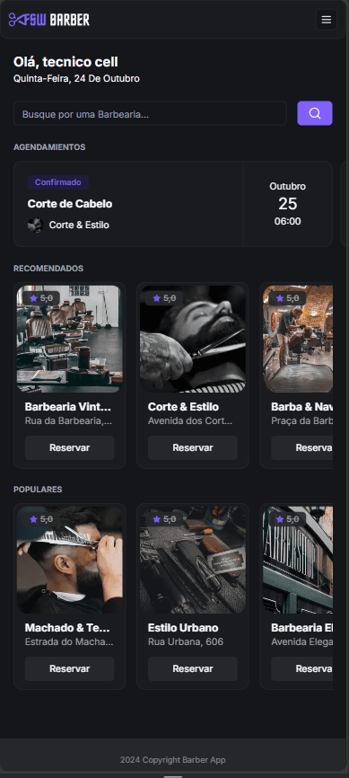
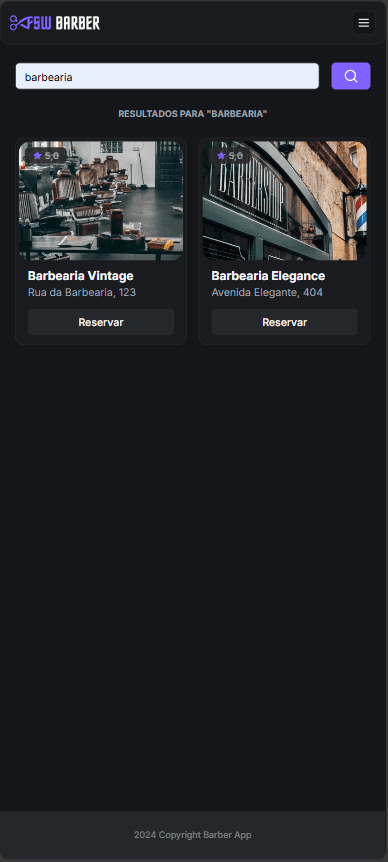
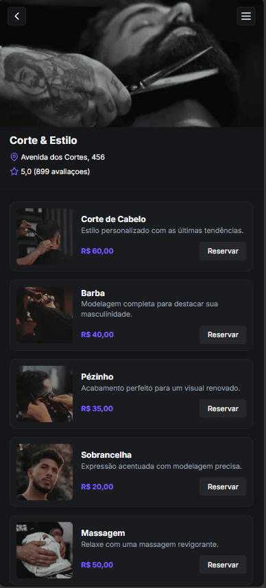
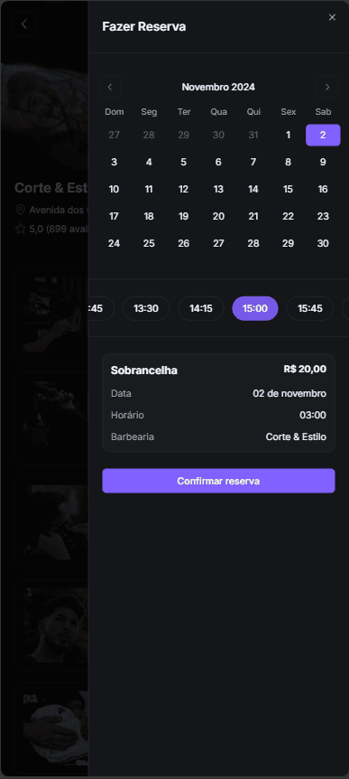
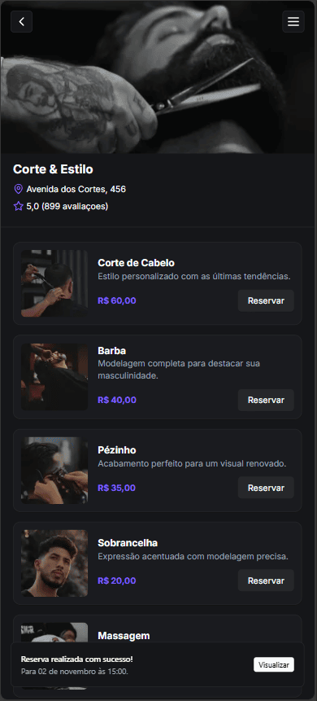
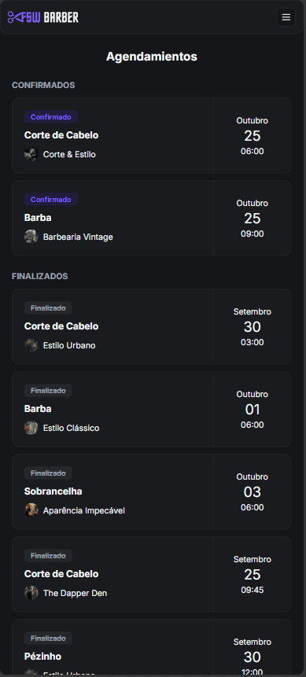
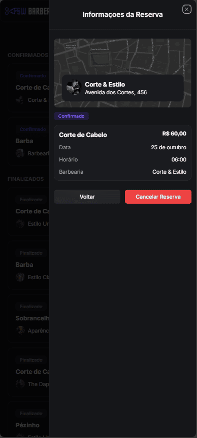
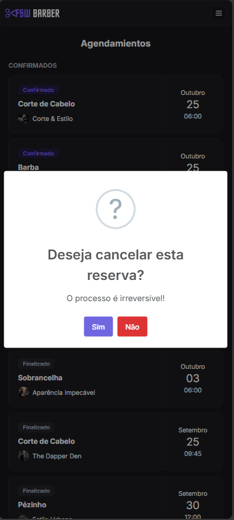
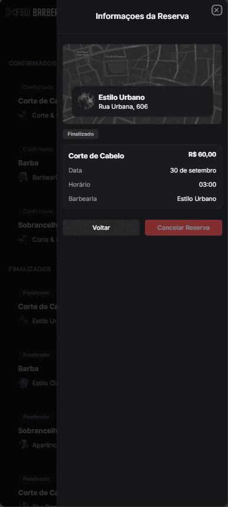
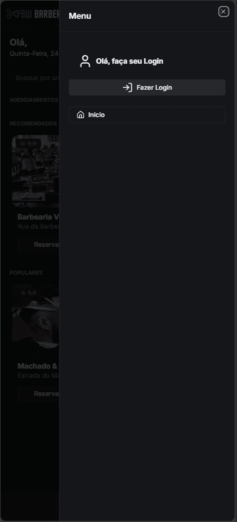
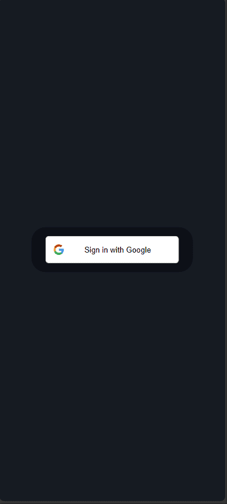
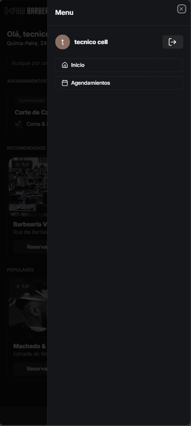

## Videos Demo

- You can watch a demonstration of my projects in the following chanel:

    https://www.youtube.com/channel/UCDIIj706aFneZlfVJucVkhA


## Getting Started

### Prerequisites

you need to install following software

1.  NODEJS(VERSION: 20.10.0)
2.  NPM(VERSION: 10.2.3)
3.  GIT

# The easiest way to get started is to clone the repository:

git clone https://github.com/ENDERSON-MARIN/BARBERSHOP-APP.git

# Change directory and open in the text editor

-   cd your-project-directory
-   open in your text editor

# Configure your environment variables (Clone the .env.template file and rename it to .env)

- DATABASE_URL="YOUR_CONNECTION_STRING"
- DATABASE_URL="YOUR_CONNECTION_STRING"
- GOOGLE_CLIENT_ID="YOUR_GOOGLE_CLIENT_ID"
- GOOGLE_CLIENT_SECRET="YOUR_GOOGLE_CLIENT_SECRET"
- NEXTAUTH_URL="YOUR_NEXTAUTH_URL"

# Very simply start your app

- Run the DB migrations
```
npx prisma migrate dev
```
- Run the seed (test data)
```
npx prisma db seed
```
- Run Prisma Studio locally
```
npx prisma studio
```
- Start the project in development mode
```
npm run dev
```
- You can check website will be up and running on localhost
http://localhost:3000

- You can check db will be up and running on localhost
http://localhost:5555


## Author

-   [Enderson Marín](https://www.marinenderson.com)

## My contact:

- 📧 Email: marinenderson1@gmail.com
- 🐱 GitHub: https://github.com/ENDERSON-MARIN
- 🌐 Portfolio: https://portfolio-ecmm.vercel.app/
- 💼 LinkedIn: https://www.linkedin.com/in/enderson-marin


## License

This project is licensed under the MIT License - see the [LICENSE.md](LICENSE.md) file for details


